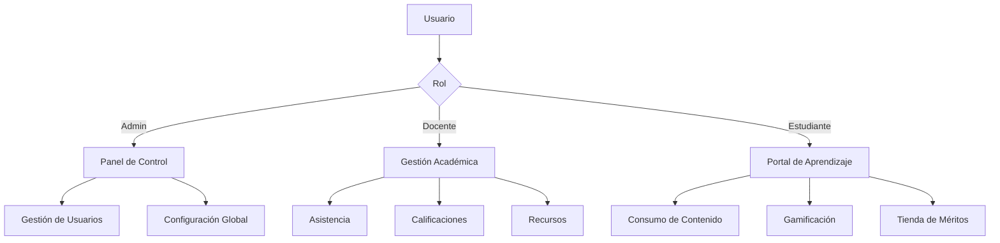

<div align="center">

# 🏛️ Martí Academy OS

### Sistema Operativo Educativo de Nueva Generación

[](https://nextjs.org/)
[](https://supabase.com/)
[](https://tailwindcss.com/)
[](https://vercel.com/)

**Plataforma institucional integral que unifica gestión académica, gamificación avanzada y comunidad educativa en un ecosistema moderno y escalable.**

[🚀 Demo en Vivo](#) • [📖 Documentación](#documentación) • [🤝 Contribuir](CONTRIBUTING.md)

</div>

---

## ✨ Características Principales

### 🎓 **Gestión Académica Completa**

- **Smart Attendance**: Pase de lista inteligente con Avatar Grid para docentes
- **Quick Grade**: Sistema de calificación ágil con feedback predefinido (escala 0-20)
- **Recursos Académicos**: Gestión y consumo de contenido educativo con recompensas XP
- **Dashboard Segmentado**: Vistas personalizadas por rol (Admin, Docente, Estudiante)

### 🎮 **Motor de Gamificación**

- **Sistema de Niveles**: Progresión basada en XP acumulativo (Lvl 1-50)
- **Daily Streaks**: Rachas de constancia con multiplicadores de XP
- **Salón de Méritos**: Tienda de insignias institucionales desbloqueables
- **Títulos Institucionales**: Rangos desde "Iniciado" hasta "Leyenda José Martí"

### 🏛️ **Operaciones Administrativas**

- **Gestión de Usuarios**: Aprobación de estudiantes y creación de docentes
- **Configuración Institucional**: Ajuste de períodos académicos y parámetros de gamificación
- **Auditoría de Actividad**: Logs de acciones críticas del sistema

### 🔒 **Seguridad de Nivel Empresarial**

- **Autenticación OAuth 2.0**: Integración con Google Sign-In
- **Row Level Security (RLS)**: Políticas de acceso granular en Supabase
- **Middleware RBAC**: Control de acceso basado en roles con caché optimizado
- **Protección de Rutas**: Segmentación automática según permisos

---

## 🛠️ Stack Tecnológico

### **Frontend**

```
Next.js 16.1.6 (Turbopack)  → Framework React con SSR/SSG
Tailwind CSS 4.0            → Diseño moderno con utility-first
shadcn/ui                   → Componentes accesibles y reutilizables
Lucide React                → Iconografía premium
```

### **Backend & Database**

```
Supabase                    → Backend-as-a-Service
PostgreSQL                  → Base de datos relacional
Supabase Auth               → Gestión de autenticación
Supabase Storage            → Almacenamiento de assets
```

### **Infraestructura**

```
Vercel                      → Despliegue y hosting
Edge Functions              → Procesamiento en el edge
Middleware                  → Protección de rutas y RBAC
```

---

## 📊 Arquitectura del Sistema

### **Modelo de Roles**



### **Flujo de Gamificación**

```
📚 Acción del Estudiante
    ↓
⚡ Trigger de XP (Asistencia, Calificación, Recurso)
    ↓
🔄 Función SQL: increment_student_xp()
    ↓
📈 Verificación de Level Up (XP >= Nivel × 100)
    ↓
🏆 Actualización de Perfil de Gamificación
    ↓
🎯 Desbloqueo de Insignias (si aplica)
```

---

## 🗄️ Esquema de Base de Datos

### **Tablas Principales**

| Tabla                   | Descripción                                          | Relaciones Clave               |
| ----------------------- | ---------------------------------------------------- | ------------------------------ |
| `profiles`              | Perfiles de usuarios con rol y datos institucionales | → `auth.users`                 |
| `classrooms`            | Aulas (Año + Sección)                                | → `academic_years`, `sections` |
| `subjects`              | Materias por aula                                    | → `classrooms`                 |
| `attendance`            | Sesiones de asistencia                               | → `subjects`, `profiles`       |
| `attendance_records`    | Registros individuales de asistencia                 | → `attendance`, `profiles`     |
| `grades`                | Calificaciones de estudiantes                        | → `profiles`, `subjects`       |
| `academic_resources`    | Recursos educativos (videos, PDFs, links)            | → `subjects`                   |
| `gamification_profiles` | XP, nivel, rachas y méritos                          | → `profiles`                   |
| `badges`                | Catálogo de insignias                                | -                              |
| `student_badges`        | Insignias otorgadas                                  | → `profiles`, `badges`         |

### **Funciones SQL Clave**

```sql
-- Incremento de XP con level-up automático
increment_student_xp(student_id uuid, xp_amount int)

-- Gestión de rachas diarias
check_in_streak(student_id uuid)

-- Cálculo de XP necesario por nivel
get_xp_for_level(lvl int) → bigint
```

---

## 🚀 Instalación y Desarrollo

### **Prerrequisitos**

- Node.js 18+
- pnpm 8+
- Cuenta de Supabase
- Cuenta de Vercel (opcional, para deploy)

### **1. Clonar el Repositorio**

```bash
git clone https://github.com/GaboInsane6489/Marti-Academy-OS.git
cd Marti-Academy-OS
```

### **2. Instalar Dependencias**

```bash
pnpm install
```

### **3. Configurar Variables de Entorno**

Crea un archivo `.env.local` en la raíz del proyecto:

```env
# Supabase
NEXT_PUBLIC_SUPABASE_URL=tu_supabase_url
NEXT_PUBLIC_SUPABASE_ANON_KEY=tu_supabase_anon_key

# Auth (opcional para desarrollo)
NEXT_PUBLIC_SITE_URL=http://localhost:3000
```

### **4. Ejecutar Migraciones de Base de Datos**

Ejecuta las migraciones en el Editor SQL de Supabase en orden:

```
supabase/migrations/
├── 20260215000000_create_profiles.sql
├── 20260215000001_academic_core.sql
├── 20260215000002_social_and_notifications.sql
├── 20260215000003_gamification_engine.sql
├── 20260216000000_attendance_and_resources.sql
├── 20260216000001_grades_and_evaluations.sql
├── 20260216000002_xp_logic.sql
├── 20260216000003_gamification_logic_v2.sql
├── 20260216000004_store_seeds.sql
└── 20260216000005_db_index_optimization.sql
```

### **5. Iniciar Servidor de Desarrollo**

```bash
pnpm dev
```

Abre [http://localhost:3000](http://localhost:3000) en tu navegador.

---

## 📁 Estructura del Proyecto

```
marti-academy-os/
├── src/
│   ├── app/                    # App Router de Next.js
│   │   ├── dashboard/          # Dashboards segmentados por rol
│   │   │   ├── admin/          # Panel administrativo
│   │   │   ├── docente/        # Portal docente
│   │   │   └── estudiante/     # Portal estudiantil
│   │   ├── login/              # Página de autenticación
│   │   └── (landing)/          # Landing page pública
│   ├── features/               # Módulos por dominio
│   │   ├── auth/               # Autenticación y sesión
│   │   └── dashboard/          # Lógica de dashboards
│   ├── config/                 # Configuración (Supabase, etc.)
│   ├── docs/                   # Documentación técnica (13 docs)
│   └── styles/                 # Estilos globales
├── supabase/
│   └── migrations/             # Migraciones SQL
├── public/                     # Assets estáticos
└── .env.local                  # Variables de entorno
```

---

## 🎨 Sistema de Diseño

### **Paleta de Colores**

- **Primary**: Blue 600 (`#2563eb`) - Acciones principales
- **Secondary**: Cyan 400 (`#22d3ee`) - Acentos
- **Background**: Zinc 950 (`#09090b`) - Fondo oscuro
- **Surface**: Zinc 900 (`#18181b`) - Tarjetas y paneles

### **Tipografía**

- **Serif**: Playfair Display - Títulos institucionales
- **Sans**: Geist Sans - Cuerpo de texto
- **Mono**: Geist Mono - Código y datos técnicos

### **Componentes Clave**

- **LevelProgressBar**: Barra de progreso animada con efectos visuales
- **BadgeCard**: Tarjeta de insignia con estados (earned/locked)
- **CreateTeacherModal**: Modal de creación de docentes con generador de contraseñas

---

## 🔐 Seguridad

### **Políticas de Row Level Security (RLS)**

Todas las tablas tienen políticas RLS habilitadas:

```sql
-- Ejemplo: Estudiantes solo ven sus propias notas
CREATE POLICY "Students can view their own grades"
ON grades FOR SELECT
USING (auth.uid() = student_id);

-- Docentes gestionan recursos de sus materias
CREATE POLICY "Teachers manage their resources"
ON academic_resources FOR ALL
USING (auth.role() = 'authenticated');
```

### **Middleware de Protección**

El archivo `src/proxy.js` implementa:

- Verificación de sesión en cada request
- Caché de rol en cookies (optimización de rendimiento)
- Redirección automática según permisos
- Protección de rutas administrativas

---

## 📈 Optimizaciones de Rendimiento

### **Implementadas**

✅ Caché de rol en cookies → Reducción de latencia del 80%  
✅ Índices estratégicos en DB → Consultas 5-10x más rápidas  
✅ Lazy loading automático con Next.js Image  
✅ Tree shaking en producción  
✅ CDN global de Vercel para assets

### **Roadmap de Optimización**

⏳ Paginación en tablas administrativas  
⏳ Service Worker para PWA  
⏳ Redis para caché de leaderboards  
⏳ Edge Functions para procesamiento de XP

---

## 🗺️ Roadmap

### **✅ Completado (Fases 0-9)**

- [x] Fundación y arquitectura
- [x] Autenticación OAuth con Google
- [x] Dashboards segmentados por rol
- [x] Módulo académico (Asistencia, Calificaciones, Recursos)
- [x] Motor de gamificación (XP, Niveles, Rachas, Tienda)
- [x] Panel administrativo
- [x] Optimización de rendimiento
- [x] Despliegue en Vercel

### **🚧 En Desarrollo (Fases 10-15)**

- [ ] Sistema social y feed institucional
- [ ] Notificaciones en tiempo real
- [ ] Horarios y calendario académico
- [ ] Leaderboards y rankings
- [ ] Video checkpoints interactivos
- [ ] Personalización avanzada de perfiles

---

## 🤝 Contribuciones

¡Las contribuciones son bienvenidas! Por favor, lee nuestra [Guía de Contribución](CONTRIBUTING.md) antes de enviar un Pull Request.

### **Proceso de Contribución**

1. Fork el repositorio
2. Crea una rama para tu feature (`git checkout -b feature/AmazingFeature`)
3. Commit tus cambios (`git commit -m 'Add some AmazingFeature'`)
4. Push a la rama (`git push origin feature/AmazingFeature`)
5. Abre un Pull Request

---

## 📄 Licencia

Este proyecto está bajo la Licencia MIT. Ver el archivo [LICENSE](LICENSE) para más detalles.

---

## 👥 Equipo

**Desarrollado por**: Gabriel Alexander González  
**Institución**: Colegio José Martí  
**Año**: 2026

---

<div align="center">

### 🌟 Si este proyecto te resulta útil, considera darle una estrella ⭐

**Hecho con ❤️ para la comunidad educativa**

</div>
